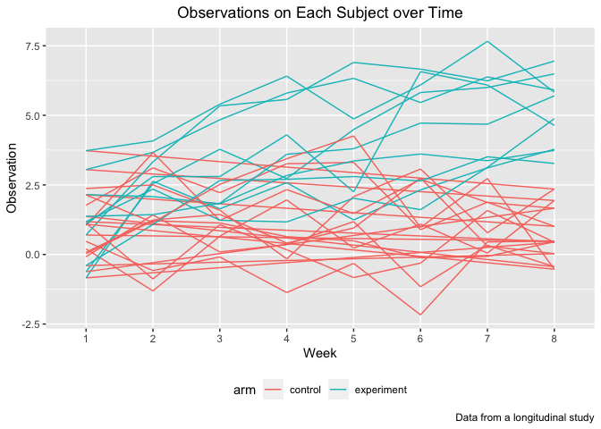
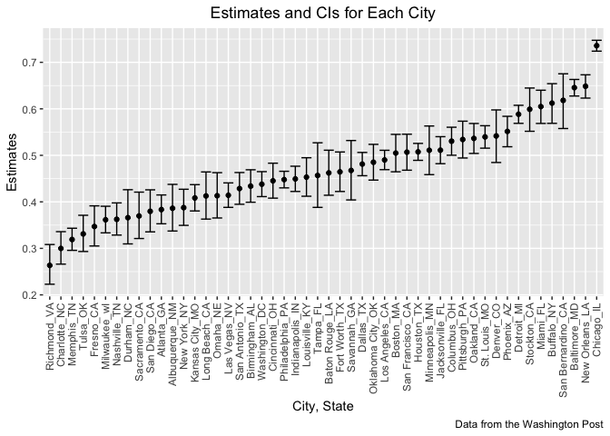

p8105_hw5_jz3571
================
Junyan Zhu
2022-11-14

``` r
library(tidyverse)
library(patchwork)
library(rvest)
```

## Problem 1

``` r
longstudy_df = 
  tibble(file_name = list.files(path =  "./data/P1") ) %>% 
  mutate(
    path = str_c("./data/P1/", file_name),
    data = map(.x = path, ~read_csv(.x))
  ) %>% 
  separate(file_name, into = c("arm", "id"), sep = "_") %>% 
  mutate(id = gsub(".csv", "", id),
         arm = recode(arm, con = "control", exp = 'experiment')) %>% 
  select(-path) %>% 
  unnest(data) %>% 
  pivot_longer(week_1: week_8,
               names_to = "week",
               values_to = "observation",
               names_prefix = "week_")
```

``` r
longstudy_df 
```

    ## # A tibble: 160 × 4
    ##    arm     id    week  observation
    ##    <chr>   <chr> <chr>       <dbl>
    ##  1 control 01    1            0.2 
    ##  2 control 01    2           -1.31
    ##  3 control 01    3            0.66
    ##  4 control 01    4            1.96
    ##  5 control 01    5            0.23
    ##  6 control 01    6            1.09
    ##  7 control 01    7            0.05
    ##  8 control 01    8            1.94
    ##  9 control 02    1            1.13
    ## 10 control 02    2           -0.88
    ## # … with 150 more rows

``` r
longstudy_df %>% 
  ggplot(aes(x = week, y = observation)) +
  geom_path(aes(color = arm,group = as.factor(id))) +
  labs(
    title = "Observations on Each Subject over Time",
    x = "Week",
    y = "Observation",
    caption = "Data from a longitudinal study") +
  theme(legend.position = "bottom") +
  theme(plot.title = element_text(hjust = 0.5))
```

<!-- -->

The experiment arm has a higher observation data compared to control
arm. The control and experiment arms had similar observations for the
first several weeks. However, as time goes, the experiment arms have a
increasing trend while the control arms have a fluctuation trend.

## Problem 2

### Describe the raw data

``` r
homicide_df = read_csv("./data/homicide-data.csv")
```

    ## Rows: 52179 Columns: 12
    ## ── Column specification ────────────────────────────────────────────────────────
    ## Delimiter: ","
    ## chr (9): uid, victim_last, victim_first, victim_race, victim_age, victim_sex...
    ## dbl (3): reported_date, lat, lon
    ## 
    ## ℹ Use `spec()` to retrieve the full column specification for this data.
    ## ℹ Specify the column types or set `show_col_types = FALSE` to quiet this message.

The raw data from Washington Post homicide data has 52179 rows and 12
columns. It recorded 52179 homicide cases with 12 variables, including
uid, reported date, victim’s last name, victim’s first name, victim’s
race, age, sex, city, state, the location of the killing in latitude and
longitude and also disposition.

### Create city_state variable and summarize total and unresolved cases within cities

``` r
homicide_city = homicide_df %>% 
  mutate(city_state = str_c(city, state, sep = "_"))

homicide_tidy = homicide_city %>% 
  group_by(city_state) %>% 
  summarise(total = n(), unresolved = sum(disposition == "Closed without arrest" | disposition == "Open/No arrest")) 
```

### Prop.test for Baltimore_MD

``` r
homicide_bal = homicide_tidy %>% 
  filter(city_state == "Baltimore_MD")

prop.test(homicide_bal$unresolved, homicide_bal$total) %>% 
  broom::tidy() %>% 
  select(estimate, conf.low, conf.high) %>% 
  knitr::kable()
```

|  estimate |  conf.low | conf.high |
|----------:|----------:|----------:|
| 0.6455607 | 0.6275625 | 0.6631599 |

### Prop.test for each city

``` r
prop_test = function(x, y){
  
  test = prop.test(x,y) %>% 
    broom::tidy() %>% 
  select(estimate, conf.low, conf.high)
  
  test
  
}

prop_city =
  map2(.x = homicide_tidy$unresolved, .y = homicide_tidy$total,
       ~prop_test(.x, .y)) %>% 
  bind_rows() %>% 
  mutate(city_state = homicide_tidy$city_state) %>% 
  select(city_state, everything())
```

    ## Warning in prop.test(x, y): Chi-squared approximation may be incorrect

``` r
prop_city
```

    ## # A tibble: 51 × 4
    ##    city_state     estimate conf.low conf.high
    ##    <chr>             <dbl>    <dbl>     <dbl>
    ##  1 Albuquerque_NM    0.386    0.337     0.438
    ##  2 Atlanta_GA        0.383    0.353     0.415
    ##  3 Baltimore_MD      0.646    0.628     0.663
    ##  4 Baton Rouge_LA    0.462    0.414     0.511
    ##  5 Birmingham_AL     0.434    0.399     0.469
    ##  6 Boston_MA         0.505    0.465     0.545
    ##  7 Buffalo_NY        0.612    0.569     0.654
    ##  8 Charlotte_NC      0.300    0.266     0.336
    ##  9 Chicago_IL        0.736    0.724     0.747
    ## 10 Cincinnati_OH     0.445    0.408     0.483
    ## # … with 41 more rows

### Plot of estimates and CIs for each city

``` r
prop_city %>% 
  mutate(city_state = fct_reorder(city_state, estimate)) %>% 
  ggplot(aes(x = city_state, y = estimate)) +
  geom_point() + 
  geom_errorbar(aes(ymin = conf.low, ymax = conf.high)) +
  theme(axis.text.x = element_text(angle = 90, vjust = 0.5, hjust = 1)) +
  labs(
    title = "Estimates and CIs for Each City",
    x = "City, State",
    y = "Estimates",
    caption = "Data from the Washington Post") +
   theme(plot.title = element_text(hjust = 0.5))
```

<!-- -->

## Problem 3

### Generate the simulation

``` r
sim_func = function(n = 30, mu = 0, sigma = 5){
  
  x = rnorm(n, mean = mu, sd = sigma)
  
  t_test = t.test(x, conf.level = 0.95) %>% 
    broom::tidy() %>% 
    select(estimate, p.value)
  
  t_test
}
```

``` r
output = vector("list", length = 5000)

for (i in 1:5000){
  
  output[[i]] = sim_func()
  
}

bind_rows(output) %>% 
  head()
```

    ## # A tibble: 6 × 2
    ##   estimate p.value
    ##      <dbl>   <dbl>
    ## 1    1.46    0.162
    ## 2   -1.30    0.101
    ## 3    0.136   0.892
    ## 4   -0.807   0.338
    ## 5   -0.288   0.724
    ## 6    0.282   0.793
