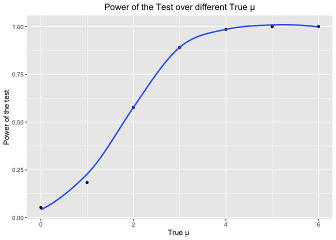
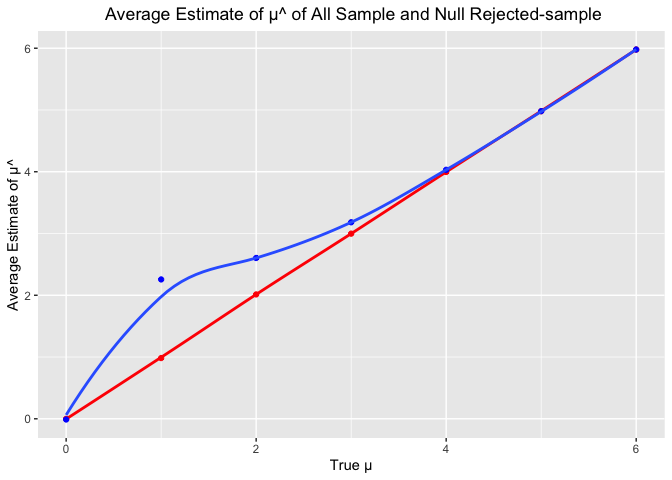

p8105_hw5_jz3571
================
Junyan Zhu
2022-11-14

``` r
library(tidyverse)
library(patchwork)
library(rvest)
```

## Problem 1

``` r
longstudy_df = 
  tibble(file_name = list.files(path =  "./data/P1") ) %>% 
  mutate(
    path = str_c("./data/P1/", file_name),
    data = map(.x = path, ~read_csv(.x))
  ) %>% 
  separate(file_name, into = c("arm", "id"), sep = "_") %>% 
  mutate(id = gsub(".csv", "", id),
         arm = recode(arm, con = "control", exp = 'experiment')) %>% 
  select(-path) %>% 
  unnest(data) %>% 
  pivot_longer(week_1: week_8,
               names_to = "week",
               values_to = "observation",
               names_prefix = "week_")
```

``` r
longstudy_df 
```

    ## # A tibble: 160 × 4
    ##    arm     id    week  observation
    ##    <chr>   <chr> <chr>       <dbl>
    ##  1 control 01    1            0.2 
    ##  2 control 01    2           -1.31
    ##  3 control 01    3            0.66
    ##  4 control 01    4            1.96
    ##  5 control 01    5            0.23
    ##  6 control 01    6            1.09
    ##  7 control 01    7            0.05
    ##  8 control 01    8            1.94
    ##  9 control 02    1            1.13
    ## 10 control 02    2           -0.88
    ## # … with 150 more rows

``` r
longstudy_df %>% 
  ggplot(aes(x = week, y = observation)) +
  geom_path(aes(color = arm,group = as.factor(id))) +
  labs(
    title = "Observations on Each Subject over Time",
    x = "Week",
    y = "Observation",
    caption = "Data from a longitudinal study") +
  theme(legend.position = "bottom") +
  theme(plot.title = element_text(hjust = 0.5))
```

<!-- -->

The experiment arm has a higher observation data compared to control
arm. The control and experiment arms had similar observations for the
first several weeks. However, as time goes, the experiment arms have a
increasing trend while the control arms have a fluctuation trend.

## Problem 2

#### Describe the raw data

``` r
homicide_df = read_csv("./data/homicide-data.csv")
```

    ## Rows: 52179 Columns: 12
    ## ── Column specification ────────────────────────────────────────────────────────
    ## Delimiter: ","
    ## chr (9): uid, victim_last, victim_first, victim_race, victim_age, victim_sex...
    ## dbl (3): reported_date, lat, lon
    ## 
    ## ℹ Use `spec()` to retrieve the full column specification for this data.
    ## ℹ Specify the column types or set `show_col_types = FALSE` to quiet this message.

The raw data from Washington Post homicide data has 52179 rows and 12
columns. It recorded 52179 homicide cases with 12 variables, including
uid, reported date, victim’s last name, victim’s first name, victim’s
race, age, sex, city, state, the location of the killing in latitude and
longitude and also disposition.

#### Create city_state variable and summarize total and unresolved cases within cities

``` r
homicide_city = homicide_df %>% 
  mutate(city_state = str_c(city, state, sep = "_"))

homicide_tidy = homicide_city %>% 
  group_by(city_state) %>% 
  summarise(total = n(), unresolved = sum(disposition == "Closed without arrest" | disposition == "Open/No arrest")) %>% 
  filter(city_state != "Tulsa_AL")

knitr::kable(homicide_tidy)
```

| city_state        | total | unresolved |
|:------------------|------:|-----------:|
| Albuquerque_NM    |   378 |        146 |
| Atlanta_GA        |   973 |        373 |
| Baltimore_MD      |  2827 |       1825 |
| Baton Rouge_LA    |   424 |        196 |
| Birmingham_AL     |   800 |        347 |
| Boston_MA         |   614 |        310 |
| Buffalo_NY        |   521 |        319 |
| Charlotte_NC      |   687 |        206 |
| Chicago_IL        |  5535 |       4073 |
| Cincinnati_OH     |   694 |        309 |
| Columbus_OH       |  1084 |        575 |
| Dallas_TX         |  1567 |        754 |
| Denver_CO         |   312 |        169 |
| Detroit_MI        |  2519 |       1482 |
| Durham_NC         |   276 |        101 |
| Fort Worth_TX     |   549 |        255 |
| Fresno_CA         |   487 |        169 |
| Houston_TX        |  2942 |       1493 |
| Indianapolis_IN   |  1322 |        594 |
| Jacksonville_FL   |  1168 |        597 |
| Kansas City_MO    |  1190 |        486 |
| Las Vegas_NV      |  1381 |        572 |
| Long Beach_CA     |   378 |        156 |
| Los Angeles_CA    |  2257 |       1106 |
| Louisville_KY     |   576 |        261 |
| Memphis_TN        |  1514 |        483 |
| Miami_FL          |   744 |        450 |
| Milwaukee_wI      |  1115 |        403 |
| Minneapolis_MN    |   366 |        187 |
| Nashville_TN      |   767 |        278 |
| New Orleans_LA    |  1434 |        930 |
| New York_NY       |   627 |        243 |
| Oakland_CA        |   947 |        508 |
| Oklahoma City_OK  |   672 |        326 |
| Omaha_NE          |   409 |        169 |
| Philadelphia_PA   |  3037 |       1360 |
| Phoenix_AZ        |   914 |        504 |
| Pittsburgh_PA     |   631 |        337 |
| Richmond_VA       |   429 |        113 |
| Sacramento_CA     |   376 |        139 |
| San Antonio_TX    |   833 |        357 |
| San Bernardino_CA |   275 |        170 |
| San Diego_CA      |   461 |        175 |
| San Francisco_CA  |   663 |        336 |
| Savannah_GA       |   246 |        115 |
| St. Louis_MO      |  1677 |        905 |
| Stockton_CA       |   444 |        266 |
| Tampa_FL          |   208 |         95 |
| Tulsa_OK          |   583 |        193 |
| Washington_DC     |  1345 |        589 |

#### Prop.test for Baltimore_MD

``` r
homicide_bal = homicide_tidy %>% 
  filter(city_state == "Baltimore_MD")

prop.test(homicide_bal$unresolved, homicide_bal$total) %>% 
  broom::tidy() %>% 
  select(estimate, conf.low, conf.high) %>% 
  knitr::kable()
```

|  estimate |  conf.low | conf.high |
|----------:|----------:|----------:|
| 0.6455607 | 0.6275625 | 0.6631599 |

#### Prop.test for each city

``` r
prop_test = function(x, y){
  
  test = prop.test(x,y) %>% 
    broom::tidy() %>% 
  select(estimate, conf.low, conf.high)
  
  test
  
}

prop_city =
  map2(.x = homicide_tidy$unresolved, .y = homicide_tidy$total,
       ~prop_test(.x, .y)) %>% 
  bind_rows() %>% 
  mutate(city_state = homicide_tidy$city_state) %>% 
  select(city_state, everything())

knitr::kable(prop_city)
```

| city_state        |  estimate |  conf.low | conf.high |
|:------------------|----------:|----------:|----------:|
| Albuquerque_NM    | 0.3862434 | 0.3372604 | 0.4375766 |
| Atlanta_GA        | 0.3833505 | 0.3528119 | 0.4148219 |
| Baltimore_MD      | 0.6455607 | 0.6275625 | 0.6631599 |
| Baton Rouge_LA    | 0.4622642 | 0.4141987 | 0.5110240 |
| Birmingham_AL     | 0.4337500 | 0.3991889 | 0.4689557 |
| Boston_MA         | 0.5048860 | 0.4646219 | 0.5450881 |
| Buffalo_NY        | 0.6122841 | 0.5687990 | 0.6540879 |
| Charlotte_NC      | 0.2998544 | 0.2660820 | 0.3358999 |
| Chicago_IL        | 0.7358627 | 0.7239959 | 0.7473998 |
| Cincinnati_OH     | 0.4452450 | 0.4079606 | 0.4831439 |
| Columbus_OH       | 0.5304428 | 0.5002167 | 0.5604506 |
| Dallas_TX         | 0.4811742 | 0.4561942 | 0.5062475 |
| Denver_CO         | 0.5416667 | 0.4846098 | 0.5976807 |
| Detroit_MI        | 0.5883287 | 0.5687903 | 0.6075953 |
| Durham_NC         | 0.3659420 | 0.3095874 | 0.4260936 |
| Fort Worth_TX     | 0.4644809 | 0.4222542 | 0.5072119 |
| Fresno_CA         | 0.3470226 | 0.3051013 | 0.3913963 |
| Houston_TX        | 0.5074779 | 0.4892447 | 0.5256914 |
| Indianapolis_IN   | 0.4493192 | 0.4223156 | 0.4766207 |
| Jacksonville_FL   | 0.5111301 | 0.4820460 | 0.5401402 |
| Kansas City_MO    | 0.4084034 | 0.3803996 | 0.4370054 |
| Las Vegas_NV      | 0.4141926 | 0.3881284 | 0.4407395 |
| Long Beach_CA     | 0.4126984 | 0.3629026 | 0.4642973 |
| Los Angeles_CA    | 0.4900310 | 0.4692208 | 0.5108754 |
| Louisville_KY     | 0.4531250 | 0.4120609 | 0.4948235 |
| Memphis_TN        | 0.3190225 | 0.2957047 | 0.3432691 |
| Miami_FL          | 0.6048387 | 0.5685783 | 0.6400015 |
| Milwaukee_wI      | 0.3614350 | 0.3333172 | 0.3905194 |
| Minneapolis_MN    | 0.5109290 | 0.4585150 | 0.5631099 |
| Nashville_TN      | 0.3624511 | 0.3285592 | 0.3977401 |
| New Orleans_LA    | 0.6485356 | 0.6231048 | 0.6731615 |
| New York_NY       | 0.3875598 | 0.3494421 | 0.4270755 |
| Oakland_CA        | 0.5364308 | 0.5040588 | 0.5685037 |
| Oklahoma City_OK  | 0.4851190 | 0.4467861 | 0.5236245 |
| Omaha_NE          | 0.4132029 | 0.3653146 | 0.4627477 |
| Philadelphia_PA   | 0.4478103 | 0.4300380 | 0.4657157 |
| Phoenix_AZ        | 0.5514223 | 0.5184825 | 0.5839244 |
| Pittsburgh_PA     | 0.5340729 | 0.4942706 | 0.5734545 |
| Richmond_VA       | 0.2634033 | 0.2228571 | 0.3082658 |
| Sacramento_CA     | 0.3696809 | 0.3211559 | 0.4209131 |
| San Antonio_TX    | 0.4285714 | 0.3947772 | 0.4630331 |
| San Bernardino_CA | 0.6181818 | 0.5576628 | 0.6753422 |
| San Diego_CA      | 0.3796095 | 0.3354259 | 0.4258315 |
| San Francisco_CA  | 0.5067873 | 0.4680516 | 0.5454433 |
| Savannah_GA       | 0.4674797 | 0.4041252 | 0.5318665 |
| St. Louis_MO      | 0.5396541 | 0.5154369 | 0.5636879 |
| Stockton_CA       | 0.5990991 | 0.5517145 | 0.6447418 |
| Tampa_FL          | 0.4567308 | 0.3881009 | 0.5269851 |
| Tulsa_OK          | 0.3310463 | 0.2932349 | 0.3711192 |
| Washington_DC     | 0.4379182 | 0.4112495 | 0.4649455 |

#### Plot of estimates and CIs for each city

``` r
prop_city %>% 
  mutate(city_state = fct_reorder(city_state, estimate)) %>% 
  ggplot(aes(x = city_state, y = estimate)) +
  geom_point() + 
  geom_errorbar(aes(ymin = conf.low, ymax = conf.high)) +
  theme(axis.text.x = element_text(angle = 90, vjust = 0.5, hjust = 1)) +
  labs(
    title = "Estimates and CIs for Each City",
    x = "City, State",
    y = "Estimates",
    caption = "Data from the Washington Post") +
   theme(plot.title = element_text(hjust = 0.5))
```

<!-- -->

## Problem 3

#### Generate the simulation

``` r
sim_func = function(n = 30, mu, sigma = 5){
  
  x = rnorm(n, mean = mu, sd = sigma)
  
  t_test = t.test(x, conf.level = 0.95) %>% 
    broom::tidy() %>% 
    select(estimate, p.value)
  
  t_test
}
```

#### Set $\mu$ = 0

``` r
output = vector("list", length = 5000)

for (i in 1:5000){
  
  output[[i]] = sim_func(mu = 0)
  
}

bind_rows(output) %>% 
  unnest()
```

    ## Warning: `cols` is now required when using unnest().
    ## Please use `cols = c()`

    ## # A tibble: 5,000 × 2
    ##     estimate p.value
    ##        <dbl>   <dbl>
    ##  1  0.381     0.730 
    ##  2 -0.257     0.720 
    ##  3 -1.43      0.0830
    ##  4 -0.00505   0.995 
    ##  5 -0.191     0.845 
    ##  6 -1.07      0.296 
    ##  7 -0.133     0.879 
    ##  8  0.000258  1.00  
    ##  9  0.424     0.620 
    ## 10 -0.142     0.831 
    ## # … with 4,990 more rows

#### Repeat above for $\mu$ = 1,2,3,4,5,6

``` r
sim_results =
  tibble(true_mu = c(0, 1, 2, 3, 4, 5, 6)) %>% 
  mutate(
    output = map(.x = true_mu, ~rerun(5000, sim_func(mu = .x))),
    test_estimate = map(output, bind_rows)
    ) %>% 
  select(-output) %>% 
  unnest()
```

    ## Warning: `cols` is now required when using unnest().
    ## Please use `cols = c(test_estimate)`

``` r
sim_results
```

    ## # A tibble: 35,000 × 3
    ##    true_mu estimate p.value
    ##      <dbl>    <dbl>   <dbl>
    ##  1       0   1.25    0.199 
    ##  2       0   0.538   0.564 
    ##  3       0  -0.650   0.444 
    ##  4       0   0.0415  0.968 
    ##  5       0  -0.947   0.323 
    ##  6       0   1.05    0.163 
    ##  7       0  -1.18    0.310 
    ##  8       0   1.72    0.0946
    ##  9       0  -0.518   0.524 
    ## 10       0   0.416   0.600 
    ## # … with 34,990 more rows

#### Make a plot showing the proportion of times the null was rejected (the power of the test) on the y axis and the true value of μ on the x axis.

``` r
sim_results %>% 
  group_by(true_mu) %>% 
  summarise(total = n(),
            rejected = sum(p.value < 0.05)) %>% 
  mutate(proportion = rejected/total) %>% 
  ggplot(aes(y = proportion, x = true_mu)) +
  geom_point() +
  geom_smooth(se = FALSE) +
  labs(
    x = "True μ ",
    y = "Power of the test",
    title = "Power of the Test over different True μ"
    ) +
   theme(plot.title = element_text(hjust = 0.5))
```

    ## `geom_smooth()` using method = 'loess' and formula 'y ~ x'

<!-- -->

As μ increases, the proportion of null which was rejected increases as
well, which means that as effect size increases, power of the test
increases.

#### Make a plot showing the average estimate of μ̂ on the y axis and the true value of μ on the x axis. Overlay a second plot (in BLUE) of the average estimate of μ̂ only in samples for which the null was rejected on the y axis and the true value of μ on the x axis.

``` r
rejected_muhat = 
  sim_results %>% 
  filter(p.value < 0.05) %>% 
  group_by(true_mu) %>% 
  summarise(ave_muhat = mean(estimate))

rejected_muhat
```

    ## # A tibble: 7 × 2
    ##   true_mu ave_muhat
    ##     <dbl>     <dbl>
    ## 1       0   -0.0116
    ## 2       1    2.26  
    ## 3       2    2.60  
    ## 4       3    3.18  
    ## 5       4    4.03  
    ## 6       5    4.98  
    ## 7       6    5.98

``` r
sim_results %>% 
  group_by(true_mu) %>% 
  summarise(ave_muhat = mean(estimate)) %>% 
  ggplot(aes(x = true_mu, y = ave_muhat)) +
  geom_point(color = "red") +
  geom_smooth(se = FALSE , color = "red") +
  geom_point(data = rejected_muhat,
            color = "blue") + 
  geom_smooth(data = rejected_muhat, se = FALSE) +
  labs(
    x = "True μ",
    y = "Average Estimate of μ^",
    title = " Average Estimate of μ^ of All Sample and Null Rejected-sample"
    ) +
  theme(plot.title = element_text(hjust = 0.5))
```

    ## `geom_smooth()` using method = 'loess' and formula 'y ~ x'
    ## `geom_smooth()` using method = 'loess' and formula 'y ~ x'

<!-- -->

The average estimate of μ^ is approximately equal to thr true $\mu$ for
all samples. However, in the rejected sample, the average estimate of μ^
is approximately equal to true $/mu$ only when true $\mu$ is greater
than 4. This means the average estimate is a good approximation of the
true $\mu$ when effect size is large, and not a good approximation when
effect size is small.
